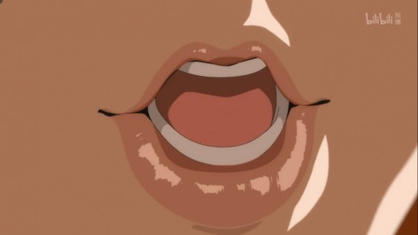
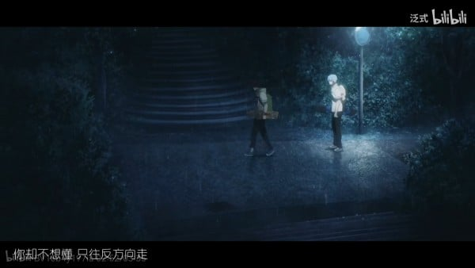
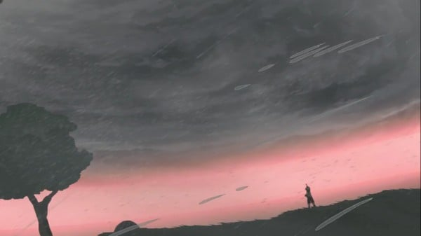
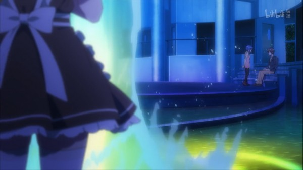
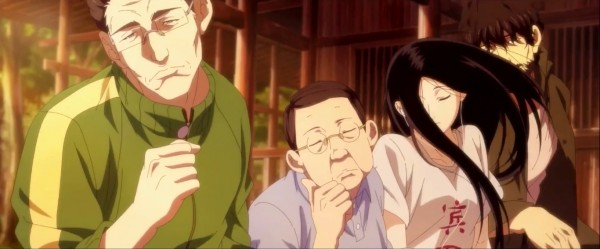
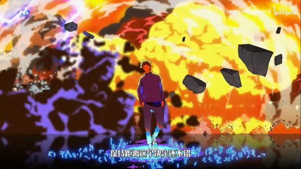
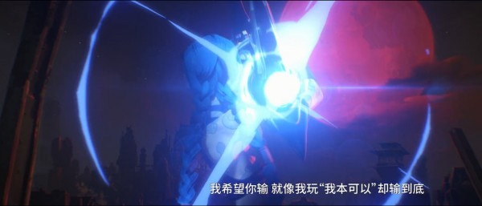

入站第一年总结（其实是7个月）

第一次写年度总结，不知道怎么写，参考了一些别人写的总结。

首先是动画方面，看了一下一整年居然看过了100多部动画，时间消失的原因找到了。

---

## 年度动画提名

> **P.S. 2022.1.5补完赛马娘2后更改**

**Top3**
- 双城之战  
- 无职转生 ～在异世界认真地活下去～ 第二季  
- 赛马娘2

**佳作提名**
- ODD TAXI  
- 平稳世代的韦驮天们  
- 平家物语  
- 86 -不存在的战区- 第二季

**OP提名**
- 小林家的龙女仆 第2期  
- 平稳世代的韦驮天们  
- 大王饶命  
- 佐贺偶像是传奇 复仇  
- 识夜描银

**国创提名**
- 时光代理人

**整活提名**
- 花样滑冰stars  
- 仙王的日常生活 第二季  
- 转生成蜘蛛又怎么样  
- 佐贺偶像是传奇 第2期  
- 寒蝉鸣泣之时 卒

**万策尽提名**
- 魔法纪录 第2期 魔法少女小圆外传  
- 逆转世界的电池少女

---

## 新番总结

### 冬季  
听说赛马娘和巴卡亚罗都很好看，可惜当时没有追，前者刚刚开始补，后者都不知道要在什么时候开始补了。  
本季原创担当《奇蛋物语》，第二个魔法少女小圆？很喜欢OP，营造的氛围很舒服。设定很有意思，女主要在一个空间内打破蛋拯救蛋中少女，每一话的战斗场面都很帅。可惜到最后没明白究竟要讲什么。（啊？这片有13话？怎么可能）  
对于芙莉露的“啵”记忆犹新，已经成PTSD了。 
《花样滑冰stars》看上去是冰上的尤里再放送，其实是年度整活番，作为一部滑冰动画，连滑冰的镜头都没有几个，看的时候几乎从头笑到尾，是冬季的周指活。  
《无限滑板》每月惯例的双男主原创运动番，很喜欢ED的风格，一开始以为是正经滑板番，后来才发现这是战斗番？后半有喜闻乐见的扭曲环节，泛式甚至为此做了个剧情mad，看过mad后把《那些你很冒险的梦》循环了好久。

《工作细胞》系列这个月出了两部，一部是《工作细胞 第2期》，比较子供向，只是人物脸上为什么都会有一层光滑的油啊，看着很诡异。  
另一部《工作细胞BLACK》相较于本篇反而更为好看，大叔死的时候甚至泪目了。  
《进击的巨人 最终季》OP太洗脑了，哒哒哒哒哒哒滴哒哒哒滴滴滴哒已经循环无数遍了。  
《堀与宫村》本季狗粮番担当，很好看，但是这种多CP的番实在是太容易脸盲了，看到最后只认得男女主。

这一季的异世界番追了好几部，一半拉跨一半还是很不错的。  
《Re:从零开始的异世界生活 第2期(后半)》漫长的圣域篇终于结束了，每集时长爆满，基本都是30分钟的文戏，据说作者长月达平本人也参与制作了，虽然好看，但是真的好漫长。  
《无职转生 在异世界认真地活下去》是难得的异世界佳作，特别值得提一提的是它的制作，虽然没有刻意的炫技，但是各种地方都有电影分镜的感觉，看到第二话鲁迪施展水圣级魔法好累积雨云的时候被震撼到了。
《转生成蜘蛛又怎么样》这次转生的原因更加奇怪了，而女主转生变成的生物居然是蜘蛛，异世界转生流的骚操作真的搞不完了(bgm38)。  
听凹酱的单口相声很欢乐，自从后半季人类魔族打起来了，人类线就越来越拉，14话人类线的分镜极其生草，值得反复回顾。

---

### 春季  
先审后播开始了，原来大部分番剧还是在B站A站上看的，4月开始不得不自己找资源了，网盘时代再开启。  
《佐贺偶像是传奇 复仇》这次又整出了好几个live，一如既往地好看，结尾出现UFO，似乎是挖了个大坑，期待续作。

《MEGALO BOX 2》相对于第一季比较沉重，BGM还是一如既往得顶，OST出了之后反复听了好几遍，结尾出乎意料，但确实是个不错的结局。

《Vivy -Fluorite Eye’s Song-》原创番只要一扯上AI，就大概率会拉跨。  
本作的核心问题——AI如何用心唱歌，对其的解释是只要一边回忆一边唱歌就是用心唱歌，可能这还不算这个问题的最佳答案吧。整体还是非常好看的，个人认为最精彩的是Grace那个篇章，包括最后冴木达也的自杀以及Vivy的失控这些超展开都让我印象深刻。Vivy VS Elizabeth和Diva VS 垣谷勇吾的两场战斗的作画很有表现力。  
《ODD TAXI》一个不知名的制作公司做的原创动画，今年自认最好看的动画之一了，幕后黑手真的出人意料，本以为人物都是动物是世界观设定，没想到居然是男主的臆想。  
《本田小狼与我》不得不说冬天女二骑自行车掉进水里，女主不叫救护车对电话另一头喊了一句super cub会救你的，然后骑着super cup去水里捞女二，还把她放在前篮筐吹风带回家的骚操作太离谱了。  
《夜之国》绘本画风的童话故事，这种类型的动画与aimer真的太契合了，个人比较喜欢第二话，EDグレースノート循环无数遍。

---

### 夏季  
《LoveLive! SuperStar!!》太好听了8！简直就是天籁！你快点掐一下可可的脸啊！唐可可太可爱了吧，另外不得不提一下这番的二创《唐可可的诱惑》年度好活。  
《Sonny Boy》老念成索尼男孩，疯房子的实验性原创番，很新奇，文戏比较多，少有的作画部分都很精彩，比如第一集希奔跑和第十一集升入太空。看不大懂但是大受震撼。

《歌剧少女》七月最大的惊喜之一，好几个单集水准非常高，可惜制作有点欠缺，另外因为这个标题导致看的人很少。  
《平稳世代的韦驮天们》七月最大的惊喜之二，MAPPA很适合做猎奇+战斗的番剧，第一次见到善堕这种剧情，可惜在最精彩的地方戛然而止，续作应该也没有了，只能漫画见了。  
《寒蝉鸣泣之时 卒》轮回了很多次，结果最后的问题用嘴炮解决了，甚至还出现了火影名场景复刻。寒蝉卒搞笑+姛+劝学番石锤。

《魔法纪录 第2期 魔法少女小圆外传》前作剧情基本不记得了，也不是手游玩家，这一季看得云里雾里的。经费似乎都去单独搞几个没几秒的战斗大场面了，导致后期直接万策尽，第六集八千代火车上回头真的笑死了。

《我们的重制人生》第五话又贡献了一个扭曲情节。

---

### 秋季  
《平家物语》这其实是22年的一月番吧……本季度很喜欢的一部作品，看完后甚至产生了去看原作的冲动。通过长大的琵琶一边弹琵琶一边把故事唱出来的叙事方式特别喜欢，整体有一种悲壮的氛围。琵琶好可爱啊！  
《无职转生 ～在异世界认真地活下去～ 第二季》第二季比第一季还要好看，频出神回，作画很顶，剧情和人物塑造都很牛逼，看起来太爽了。  
《86 -不存在的战区- 第二季》又是一部第二季比第一季还要好看的，第16集甚至可以算作神回了，这一集以后观感直线上升，虽然频繁出sp，还是保持的很高的水准，可惜还有两集要等到3月份，已经等不及了啊！另外这一季的女主持续掉线，基本没有出现。  
《逆转世界的电池少女》设定挺有趣的，基于宅文化写的剧情，玩了好多梗，甚至还致敬了EVA，OP有种前几年的感觉。可惜又是工期爆炸万策尽，各种声音、画面缺失，静止帧和意义不明的分镜再次复刻。

---

### 剧场版  
今年上映的剧场版好几部都是期待了很久的。  
- 《新・福音战士剧场版：终》见证了真嗣的成长，终于有个不错的结局了。
- 《银魂 THE FINAL》你终终终终终于完结了！ 
- 《剧场版 紫罗兰永恒花园》是我喜欢的HE啊，薇尔莉特和少佐终于在一起了，高兴。  
- 《剧场版 Fate/stay night [Heaven's Feel] III.spring song》制作太牛逼了，卫宫和berserker打的那一段BGM why I fight ～EMIYA～ (spring song 2020 ver.)特别带感。  
- 《名侦探柯南 绯色的子弹》把柯南每年一部的剧场版当动作爽片看似乎就没有那么烂了，反而还很好看的样子。  
- 《你好 世界》3D略显奇怪，最后未来的男主帮助男主和女主在一起的剧情感动到了，web动画《ANOTHER WORLD》补全了挺多细节的。  
- 《剧场版 鬼灭之刃 无限列车篇》大哥和上弦三开打的那一段BGM巨牛，似乎是OST的第三十几首？忘记了。大哥死的那一段还是挺难受的。

---

### 国动  
今年国动看得比较少，整体感受是国动真的太能整活了，还总有些新奇的设定，今年还有好几个很不错的OP和ED。  
- 值得一提的是原创动画《时光代理人》，画风偏韩风，一两集一个单元剧，看男主穿越到过去执行委托的故事还是很有趣的，ED总是在最精彩的地方神插入，最后又挖了个大坑啊，希望第二季快点来。  
- 偶然在B站上刷到《让我们烧吧！！！》，只有两集就点进去看了一下，看起来是一部被腰斩的古早作品，作者属实有点放飞自我。  
- 重置版的《镇魂街 第二季》终于来了，真的没想到居然能用前一版是剧中人物当导演做出来的烂作这种借口来解释，比前一版好多了，但是台词真的太尬了吧，完全还原原作，有些地方实在太有槽点了。  
- 《人偶学院》崩坏3的泡面番，比较日常没什么剧情，ED太上头了。  
- 魔道祖师系列最后一作《魔道祖师 完结篇》终于放送了，已经等了好久了，OP一如既往地很喜欢，节奏有点快，但是这次讲的这几对真的都好意难平啊。  
- 《识夜描银》这部作品在B站推送之前都没有听说过，追的过程中一直有种找不着主线的感觉，结果发现11集下来抛了一堆设定但是主线基本没有开始。OP非常有特色，ED也不错，两首歌都很好听。  
- 《一人之下4·碧游村篇》这一季总感觉有些集数特别水，有些集数特别好看，ED整活太好玩了，特别是《异人disco》，宝儿姐跳起来太好玩了。

- 《仙王的日常生活 第二季》虽然还没有更完，但是已经看出制作组完全地开始摆烂走整活流了，ep.8梦幻联动了憨色冷鸟，ep.10主角团参观制作公司顺便摆烂，ep.11直接给王令孙蓉升维，都不知道该称之为好活还是烂活了，OP莫名有些上头，还是不错的。  
- 《大王饶命》也是没有播完的一部，OP挺强的，整体的美术风格很新颖，听说有很多大佬参与，个人认为歌与画面挺契合的，只是正片一般，这能算OP欺诈吗？主要看吕树怼别人很有趣。  
- 还补了去年没看的《全职高手2》，画风与前一季相差比较大，看多了就比较习惯了，ED歌挺喜欢的，前几秒的叶修戴耳机摇头一段配上音乐节奏感好强。  
- 另外今年还有两部有生之年系列开始周更了，分别是《风灵玉秀》和《罗小黑战记》，可喜可贺，可喜可贺。

---

### 美漫  
本来不大会接触美漫，但今年出现了一匹大黑马。  
《双城之战》是英雄联盟的首部动画剧集，三渲二技术一流，差不多每一集出一个高质量的主题曲，配乐很强。  
知道这部作品的时候已经出了一半了，就干脆屯到完结再看，一下子补完真的爽，甚至让我把一两年前卸载的LOL重新下回来了。

---

## 漫画、小说和补番

### 漫画  
- 《进击的巨人》本来没看过，看了最终季之后打算补一下，一口气看完的，有种落差感，可能结尾停在地鸣发动挺好的吧。总体水准还是很高的，分镜很强。  
- 《电锯人》火起来了之后去看了一下，说实话真的好强啊，特别喜欢这种电影般的分镜，每场战斗都很爽。  
- 翻泛式老视频的时候翻到关于《狼之口》的杂谈，感兴趣就来补了。一部历史漫画，前期比较猎奇，也是最精彩的部分，沃夫朗死了之后，剧情就变为了不同的历史剧情。  
- 《大正处女御伽话》看到动画化的消息就连夜补完，男女主之间真的好甜，改成动画之后反而感觉动画没漫画好看了。  
- 《谷围南亭》终于完结了，条漫里精彩的一类，太岁的设定很帅，一边看高影解开谜团，与最终boss战斗，一边看两个男主卖腐，其中还穿插一些搞笑日常，很适合我看的一类作品。

### 小说  
- 开始看了两本，但是已经搁置很久。

---

## 21年度看完作品列表（新番分类）

### 冬季新番 
- 奇蛋物语/ワンダーエッグ・プライオリティ  
- 花样滑冰stars/スケートリーディング☆スターズ  
- 无限滑板/SK∞ エスケーエイト  
- 工作细胞 第2期/はたらく細胞 第2期    
- 工作细胞BLACK/はたらく細胞BLACK    
- 进击的巨人 最终季/進撃の巨人 The Final Season  
- Re:从零开始的异世界生活 第2期(后半)/Re:ゼロから始める異世界生活 2nd season 後半クール  
- 堀与宫村/ホリミヤ  
- 无职转生 在异世界认真地活下去/無職転生～異世界行ったら本気だす～  
- 转生成蜘蛛又怎么样/蜘蛛ですが、なにか？  
- 关于我转生变成史莱姆这档事 第2期(前半)/生したらスライムだった件 第2期 第1部  
- 怪病医拉姆尼/怪病医ラムネ  
- 天地创造设计部/天地創造デザイン部  
- 石纪元 第2期/Dr.STONE STONE WARS  
- 怪物事变/怪物事変  
- 动物狂想曲 第2期/EASTARS ビースターズ 第2期  
- 文豪野犬 汪/文豪ストレイドッグス わん！  
- 幼女社长/幼女社長

### 春季新番
- 佐贺偶像是传奇 第2期/ゾンビランドサガ リベンジ  
- MEGALO BOX 第2期/NOMAD メガロボクス2  
- Vivy -Fluorite Eye’s Song-  
- ODD TAXI/オッドタクシー  
- 本田小狼与我/スーパーカブ  
- SSSS.DYNAZENON  
- 致不灭的你/不滅のあなたへ  
- 极主夫道/極主夫道  
- 夜之国/夜の国  
- 86 不存在的战区/86-エイティシックス-  
- 影宅/シャドーハウス  
- 剃须 然后捡到女高中生/ひげを剃る。そして女子高生を拾う。  
- 如果究极进化的完全沉浸RPG比现实更垃圾的话/究極進化したフルダイブRPGが現実よりもクソゲーだったら  
- MARS RED

### 夏季新番
- 白砂水族馆/白い砂のアクアトープ  
- LoveLive! SuperStar!!/ブライブ！スーパースター!!  
- 漂流少年/Sonny Boy  
- 小林家的龙女仆 第2期/小林さんちのメイドラゴンS  
- 平稳世代的韦驮天们/平穏世代の韋駄天達  
- 歌剧少女/かげきしょうじょ!!  
- 寒蝉鸣泣之时 卒/ひぐらしのなく頃に卒  
- 魔法纪录 第2期 魔法少女小圆外传/マギアレコード 魔法少女まどか☆マギカ外伝 2nd SEASON  
- 关于我转生变成史莱姆这档事 第2期(后半)/転生したらスライムだった件 第2期 第2部  
- 阴晴不定大哥哥/うらみちお兄さん  
- 死神少爷与黑女仆/死神坊ちゃんと黒メイド  
- 我们的重制人生/ぼくたちのリメイク

### 秋季新番
- 平家物语/平家物語  
- 加油啊同期酱/がんばれ同期ちゃん  
- 海贼王女/海賊王女  
- 鬼灭之刃 无限列车篇/鬼滅の刃 無限列車編  
- 无职转生 ～在异世界认真地活下去～ 第二季/無職転生 ～異世界行ったら本気だす～ 第2クール  
- 86 -不存在的战区- 第二季/86―エイティシックス― 第2クール  
- 逆转世界的电池少女/逆転世界ノ電池少女  
- Deji Meets Girl/でーじミーツガール  
- 极主夫道 第二季/極主夫道 パート2

### 国动/美漫
- 凡人修仙传 特别篇 燕家堡大战  
- 风灵玉秀  
- 伍六七之玄武国篇 下篇  
- 灵笼:INCARNATION 终章  
- 镇魂街 第二季  
- 时光代理人  
- 罗小黑战记 众生之门篇  
- 人偶学院  
- 百妖谱 第二季  
- 黑白无双 第三季  
- 魔道祖师 完结篇  
- 识夜描银  
- 一人之下4·碧游村篇  
- 仙王的日常生活 第二季  
- 大王饶命  
- 猫之茗  
- 凡人修仙传 魔道争锋  
- 双城之战

### 补的动画
- Happy Sugar Life/ハッピーシュガーライフ  
- 新石纪/Dr.STONE  
- BEASTARS  
- はたらく細胞/工作细胞  
- MEGALO BOX/メガロボクス  
- 海盗战记/ヴィンランド・サガ  
- 佐贺偶像是传奇/ゾンビランドサガ  
- Flip Flappers/フリップフラッパーズ  
- 日常/日常  
- 缘之空/ヨスガノソラ  
- One Room第一季、第二季、第三季  
- 头文字D/頭文字D  
- 头文字D Second Stage/頭文字D Second Stage  
- 头文字D Third Stage/頭文字D Third Stage  
- 头文字D Fourth Stage/頭文字D Fourth Stage  
- 日在校园/School Days  
- 命运石之门/STEINS;GATE  
- 寒蝉鸣泣之时/ひぐらしのなく頃に  
- 寒蝉鸣泣之时 解/ひぐらしのなく頃に解  
- 寒蝉鸣泣之时 业/ひぐらしのなく頃に 業  
- 未来日记/未来日記  
- Love Live!/ラブライブ!  
- 男子高中生的日常/男子高校生の日常  
- 小林家的龙女仆/小林さんちのメイドラゴン  
- 龙与魔女/BURN THE WITCH  
- 玉子市场/たまこまーけっと  
- 黑塔利亚/ヘタリア Axis Powers  
- 灵能百分百/モブサイコ100  
- 灵能百分百 第二季/モブサイコ100 II  
- 海猫鸣泣之时/うみねこのなく頃に  
- 幼女战记/幼女戦記  
- 化物语/化物語  
- 乒乓/ピンポン THE ANIMATION  
- 全职高手2  
- 让我们烧吧！！！  
- 黑白无双  
- 黑白无双 第二季  
- 爱、死亡 & 机器人 Love, Death & Robots

### 剧场版
- 新世纪福音战士剧场版 死与新生/新世紀エヴァンゲリオン劇場版 シト新生  
- 新世纪福音战士剧场版 Air/真心为你/新世紀エヴァンゲリオン劇場版 Air/まごころを、君に  
- 福音战士新剧场版：序/ヱヴァンゲリヲン新劇場版:序  
- 福音战士新剧场版：破/ヱヴァンゲリヲン新劇場版:破  
- 福音战士新剧场版：Q/ヱヴァンゲリヲン新劇場版:Q  
- 剧场版 魔法少女小圆 [前篇] 起始的物语/劇場版 魔法少女まどか☆マギカ [前編] 始まりの物語  
- 剧场版 魔法少女小圆 [后篇] 永远的物语/劇場版 魔法少女まどか☆マギカ [後編] 永遠の物語  
- 剧场版 魔法少女小圆 [新篇] 叛逆的物语/劇場版 魔法少女まどか☆マギカ [新編] 叛逆の物語  
- 剧场版 Fate/stay night [Heaven's Feel] III.spring song/劇場版 Fate/stay night [Heaven's Feel] III.spring song  
- 名侦探柯南 绯色的不在场证明/名探偵コナン 緋色の不在証明  
- 名侦探柯南 绯色的子弹/名探偵コナン 緋色の弾丸  
- 你好 世界/HELLO WORLD  
- 剧场版 鬼灭之刃 无限列车篇/劇場版 鬼滅の刃 無限列車編  
- 剧场版 Fate/Grand Order 神圣圆桌领域卡美洛 前篇 Wandering; Agateram/劇場版 Fate/Grand Order -神聖円卓領域キャメロット- 前編 Wandering; Agateram  
- 命运石之门 负荷领域的既视感/STEINS;GATE 負荷領域のデジャヴ  
- 新・福音战士剧场版：终/シン・エヴァンゲリオン劇場版:│▌  
- 银魂 THE FINAL/銀魂 THE FINAL  
- 海兽之子/海獣の子供  
- 乔西的虎与鱼/ジョゼと虎と魚たち  
- 玉子爱情故事/たまこラブストーリー  
- 剧场版 紫罗兰永恒花园/劇場版 ヴァイオレット・エヴァーガーデン  
- 幼女战记 剧场版/幼女戦記 劇場版

### OVA/OAD/SP
- Fate/Prototype  
- ANOTHER WORLD  
- 进击的巨人 LOST GIRLS/進撃の巨人 LOST GIRLS  
- 日在校园OVA 魔法少女小心心/School Days OVA スペシャル ～マジカルハート☆こころちゃん～  
- 日在校园OVA 情人节/School Days 「Valentine Days」  
- 寒蝉鸣泣之时外传 猫杀篇/ひぐらしのなく頃に外伝 猫殺し編  
- 寒蝉鸣泣之时 礼/ひぐらしのなく頃に礼  
- 寒蝉鸣泣之时 煌/ひぐらしのなく頃に煌  
- 寒蝉鸣泣之时 扩/ひぐらしのなく頃に拡〜アウトブレイク〜  
- 未来日记Redial/未来日記リダイヤル  
- 男子高中生的日常 特典/男子高校生の日常 特典映像  
- 头文字D Extra Stage/頭文字D Extra Stage  
- 堀桑与宫村君/堀さんと宮村くん  
- 银魂 THE SEMI-FINAL/銀魂 THE SEMI-FINAL  
- 总之就是非常可爱 ～SNS～/トニカクカワイイ ～SNS～  
- 幼女战记 沙漠意面大作战/幼女戦記 砂漠のパスタ大作戦  
- 灵能百分百 第一回灵能相谈所犒劳旅行～心满意足的治愈之旅～/モブサイコ100 第一回霊とか相談所慰安旅行～ココロ満たす癒やしの旅～  
- 进击的巨人 OAD/進撃の巨人 OAD  
- 进击的巨人 无悔的选择 OAD/進撃の巨人 悔いなき選択 OAD  
- 从漫画了解！Fate/Grand Order/マンガで分かる！Fate/Grand Order  
- 灵笼:INCARNATION 特别篇  
- 命运石之门 聪明睿智的认知计算/STEINS;GATE 聡明叡智のコグニティブ・コンピューティング  
- 奇蛋物语 特别篇/ワンダーエッグ・プライオリティ 特別編  
- 玛露露库的日常/マルルクちゃんの日常  
- 天官赐福 特别篇  
- 迷你龙小剧场/ミニドラ

### 书籍
- 进击的巨人/進撃の巨人  
- 电锯人/チェンソーマン  
- 大正处女御伽话/大正処女御伽話  
- 狼之口/狼の口 〜ヴォルフスムント〜 
- Happy Sugar Life ～幸福甜蜜生活～/ハッピーシュガーライフ  
- 谷围南亭  
- 崩坏3rd  
- 猫之茗  
- 秒速5厘米 one more sid/秒速5センチメートル one more side