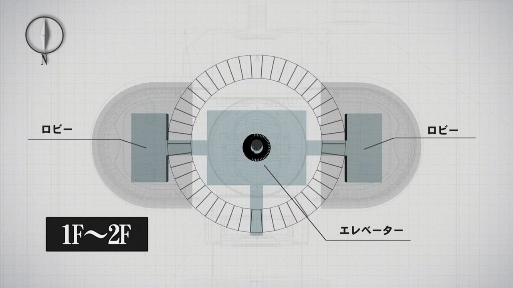
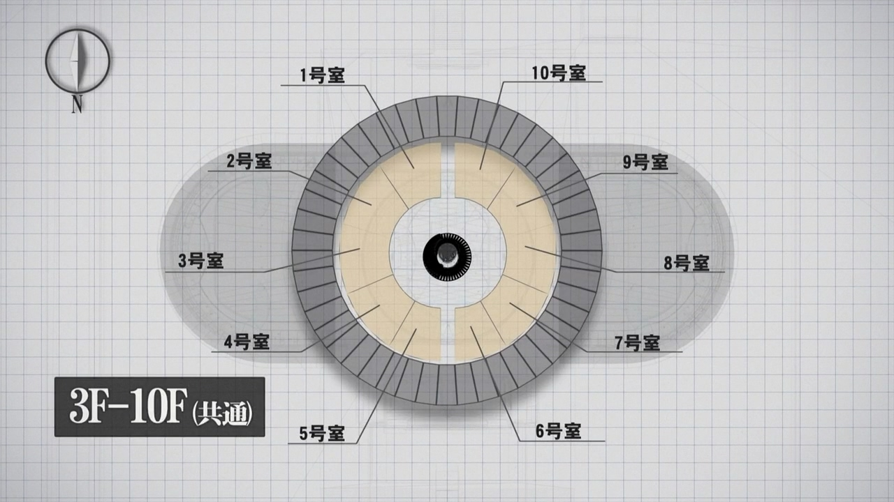

## 故事时间线
#### 杀人考察（前）
**1995年初** 黑桐干也遇见两仪式  
**1995年4月** 白纯里绪遇见两仪式  
**1995年5月** 白纯里绪喜欢上两仪式  
**1995年7月某日到1996年3月左右** 白纯里绪告白被两仪式拒绝，当天晚上打死了人，此后受荒耶宗莲怂恿连续杀人，被害者共六人

#### 珈蓝之洞
**1996年3月** 两仪式第一次遇见荒耶宗莲，然后被车撞伤，昏迷住院，织消失  
**1998年6月** 两仪式苏醒，直死之魔眼出现  

#### 痛觉残留
**1998年7月** 浅上藤乃事件，受害者七人  

#### 未来福音
**1998年8月3日** 黑桐干也遇见瀬尾静音，两仪式解决炸弹事件  
**1998年8月31日** 黑桐鲜花与之后的室友瀬尾静音相遇  

#### 俯瞰风景
**1998年8月8日到1998年8月31日** 巫条大厦连续八人自杀，事件主导者巫条雾绘作为第八人坠楼身亡，整个事件幕后为荒耶宗莲  

#### 矛盾螺旋
**1998年5月左右到1998年11月**
臙条巴杀死母亲，逃离公寓（5月左右）  
黑桐干也离开一个月，两仪式遇见臙条巴（9、10月左右）  
黑桐干也回来，与苍崎橙子调查小川公寓（10、11月左右）  
臙条巴发现问题所在，与两仪式前往调查  
两仪式被荒耶宗莲困住，臙条巴逃跑  
臙条巴和黑桐干也在两仪式的公寓遇见  
苍崎橙子前往螺旋公寓，遇见荒耶宗莲和阿鲁巴，被杀死  
黑桐干也和臙条巴前往小川公寓救两仪式  
苍崎橙子（2号）前往小川公寓，阿鲁巴被橙子杀死  
荒耶宗莲被两仪式杀死，事件解决（11月某日或某两日）  

#### 忘却录音
**1998年10月** 橘佳织目睹叶山毒瘾发作倒地，于是被叶山注射毒品  
**1998年11月** 橘佳织上课时毒瘾发作，跑到旧校舍企图自杀，此后叶山心肌梗塞而死，被黄路作为妖精的原材料  
**1999年1月** 黑桐鲜花和两仪式调查妖精事件，事件解决  

#### 杀人考察（后）
**1999年2月** 观布子市连续杀人事件，被害者七人，凶手白纯里绪  
两仪式杀死白纯里绪，事件解决  

## 线索                    

### 准备的棋子有三
>杀人考察（前）

依存死亡 浮游于世的二重身体者→杀人考察（前） 两仪式  
接触死亡 为之欢愉的存在不适合者→俯瞰风景 巫条雾绘  
逃避死亡 领悟真我的起源觉醒者→ 痛觉残留 浅上藤乃  
于相生相克的螺旋待君亲临→矛盾螺旋  

### 小川公寓原理
>矛盾螺旋
>（个人猜测不一定准）

小川公寓原本设计西栋401室-405室，东栋406室-410室。  
每段楼梯都是两层的高度，但是1层一定有楼梯所以东、西栋中一定有一栋的1层楼梯在地下还埋了一半。  
螺旋电梯每上一层转半圈，1、3、5、7、9层的电梯口在东栋，2、4、6、8、10层在西栋。  
装电梯前，东栋、西栋门牌号互换，所以臙条家住东栋410，门牌号却是405。  
此时1、2、4、6、8、10层楼梯口在东栋，1、3、5、7、9层楼梯口在西栋。  
因此楼梯口前方直走，转弯最后一家是臙条家。  
装电梯后，门牌号归位，臙条家住西栋405，门牌号405。  
此时楼梯像火箭铅笔一样往上移了一层，1、2、4、6、8、10层楼梯口在西栋，1、3、5、7、9层楼梯口在东栋。  
因此楼梯口前方直走，转弯最后一家仍然是臙条家。  
四楼原居民住处（放置尸体的地方）为东栋406室-410室，装电梯前门牌号互换被认为是401室-405室，轮回的地方在西栋401室-405室。  

### 荒耶宗蓮
あらや そうれん  
Araya Souren  
阿赖耶识  
アラヤ識  
araya shiki  

### 日记
>杀人考察（后）

白纯里绪日记本封面上写的Tagebuch是德语，意为日记