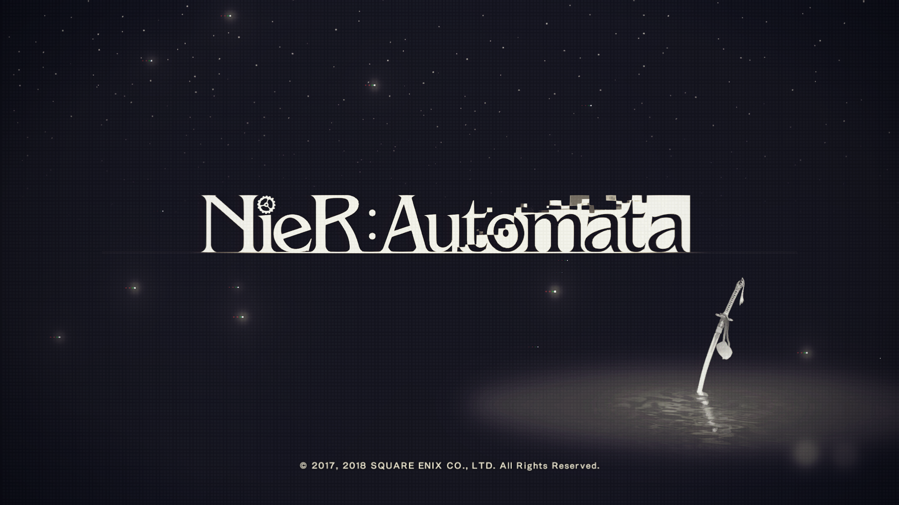
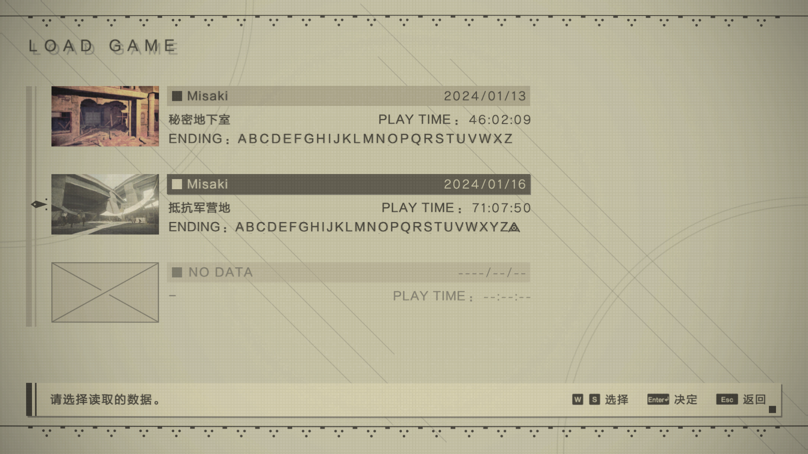

[SlotData_1.dat](./SlotData_1.dat)

↑ 尼尔全收集全结局存档

存档食用说明

打开尼尔存档共享工具，导入存档文件后输入steam id和想取的玩家名字，将输出文件移动至尼尔存档文件夹即可（一般路径为：我的文档/My Games/NieR_Automata）

注：Steam账户id是一串数字，跟steam昵称和账户名没有关系，不是一个东西，切勿混淆。（获取方式详见steam官方[FAQ](https://help.steampowered.com/zh-cn/faqs/view/2816-BE67-5B69-0FEC)

---

**“划分机械生命体和我们人造人的到底是什么呢？拥有意识和感情的机器人们，他们临死之际的挣扎、最后的呼喊，现在依然还残留在我当中。”**

Nier整部游戏被分为两个部分，AB结局所属的部分和CD结局所属的决战部分。这是一个围绕着2B、9S、2A展开的探讨“机械”与“感情”的故事。

人类总认为自己是与世界上的其他群体不同，比他们更加“高级”，而人类区分一个群体是否“高级”的标准，是感情。他们理所应当地认为外星人和他们所制造出的战争道具——机械生命体和人造人——是没有情感的道具。这一观点进而成为人造人逻辑中的一个基础规则。然而在2B和9S下派的地球执行任务的过程中，他们所遇到的机械生命和所谓出错的人造人却在无时不刻告诉他们——机械这些被认为是道具的个体，也是可以衍生出情感的。“机械不可能有活着的欲望”、“机械不可能想要歌唱给他人”、“机械不可能厌恶战争”、“机械不可能组成家庭并珍惜家人”……这种矛盾感充斥在整个游戏当中，也是最能给予我震撼的点。

---

2023.3.19-2023.7.5

被动画版吸引去打游戏，碍于Nier实在是有点贵选择了盗版，平时没什么时间，游戏都是一点一点推的。初通ABCD四个结局带来的震撼属实有点大，通关后愈发想打E结局，就趁着steam夏促把正版入手了。

第一次打E结局时听说选捐档会删档，便没有选择想搞个全收集再说，后来发现捐档有个特殊主界面，就复制了二档想再打一遍E结局顺便把档捐了。这也算是犯了个小错误吧，本以为捐档只把当前玩的那个档删除，没想到是游戏数据全清，于是就眼睁睁看着自己还差一点就全收集的一档消失了。这个时候一档已经打了55个小时，除了Y结局全通（在搞武器全满级，有些麻烦），支线88%，收集物也都搞得七七八八了。

因此重开个档再肝一遍吧，也算是回顾整个游戏了。

2024.1.16

全收集达成

