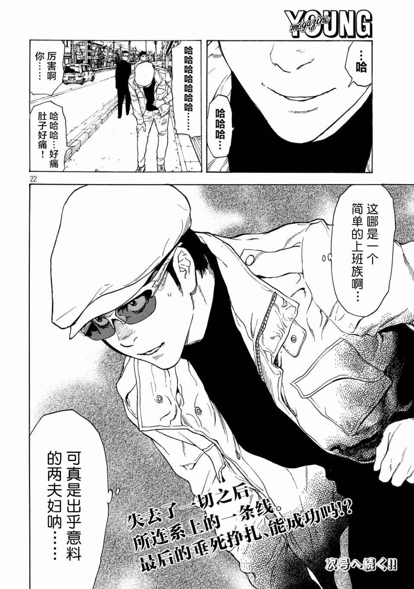
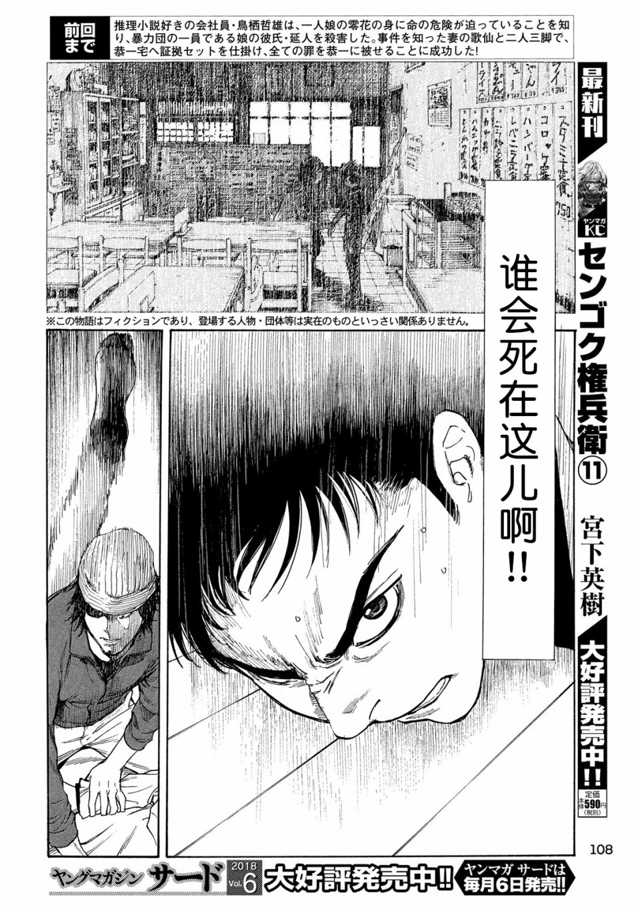
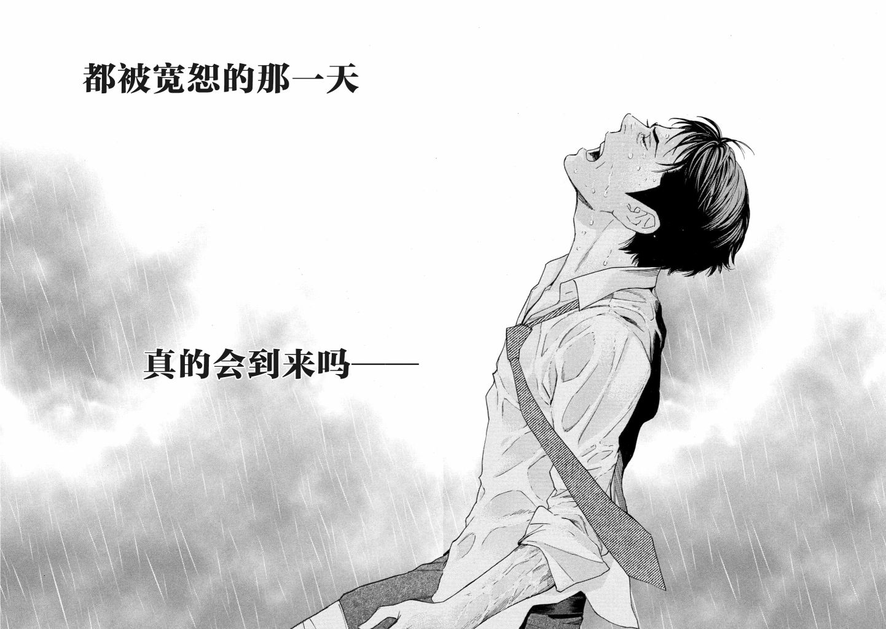
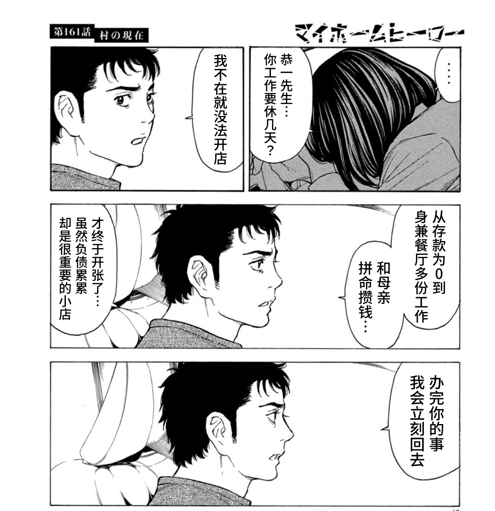
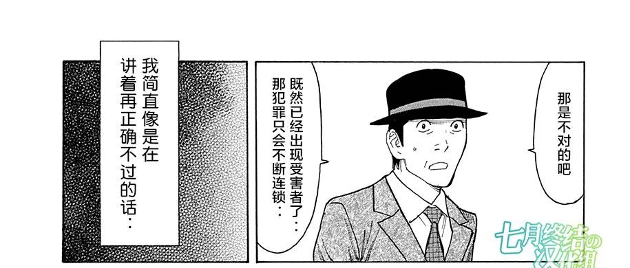

# MY HOME HERO

两周不到补完了，一部很戳我的剧情向漫画，~~甚至勾起了我回去看辣鸡漫改动画的欲望~~。

以亲情为主题、普通人为主角的作品总是那么容易让读者共情。

关于大家的诟病的强行续篇问题，诚然这一操作确实在后期引起了一些问题。第二部的结尾明明可以直接以组织覆灭、男主伏法结束整个故事，却为了画第三部导致漥的战力完全崩坏，确实有点狗尾续貂了。不过好在第三部完善了女儿零花这个在前两部较为工具人的角色，体现她的成长，~~而且还给我最喜欢的一位角色——恭一小哥加了戏份~~，只能说强行续篇有利有弊吧。

# 精彩的智斗与巧妙的叙事

不得不说第一部确实是最好看的一部分，男主一人与黑帮对峙，动用一切诡计，剧情反转再反转。作者在多处使用了倒叙解密的方式，先渲染紧张刺激的氛围，让读者以为男主危了，然后再给出一个出乎意料的结果，最后解释男主用的手法，看着就捏把汗，很是精彩。在讲述各个角色经历时，作者也使用了同样的方式，有种让读者把拼图一片一片拼起来的感觉，拼完后便是恍然大悟，我个人是很喜欢这种手法的。

老婆歌仙也是少有的神队友类型，并没有什么高血压操作，反而是女儿前期看起来比较“蠢”，不过考虑的她的叛逆期和被父母瞒着真相，我是能谅解这种“蠢”的。

后期作者也用到这一手法，不过第二部重心逐渐从势单力薄的一个家庭移至组织之间争斗，减少了缜密诡计，更多的就是简单诡计配上硬碰硬，因此看起来不如第一部惊艳，这点就比较遗憾了。

# 亲情

友情、爱情、亲情是绝大多数ACGN作品的情感内核，相对来说前两者是较为好写也更受观众欢迎的题材，以亲情为主旋律的作品是最稀少的，但亲情作为人类最开始能感受到的情感，我认为是最能引起读者共鸣的了。

亲情是贯穿整部作品的主线索，哲雄杀死延人——一切的一切始于父亲对女儿的爱。夫妻俩携手对抗组织源于亲情；麻取义辰无论如何都要找到凶手并赶尽杀绝源于亲情；恭一拼命攒钱、拼命活下去源于亲情；志野和小泽谦信虽起点不同，但他们想要捣毁组织的决心都源于亲情。可以发现大部分角色的故事都是由亲情推动，是亲情将他们推下悬崖，也是亲情鼓动他们活下去的决心，这些角色不同的命运最终交织在一起，促成了整个故事。

另外利用亲情，作者巧妙地拉近了黑道题材故事与观众之间的距离，让角色更像随处可见的普通人，这使我更容易共情了。

# 矛盾感与人物立体

零花逮捕父亲这个结局虽说比较典，不过也是戳到我的。一边是亲情，养育自己多年、为了自己才走上修罗道路的父亲；一边是正义，自己面对的是杀了数人，甚至导致整个村被屠杀的杀人凶手。要在两者之中抉择何其难。

.png)

作者非常擅长利用这种矛盾和反差感，借此赋予角色立体感，让作品更深入人心。这点从选材就能看出来了，平凡的父亲为了保护女儿杀死她的黑道男友，一个三口家庭对战黑道家庭的故事，怎么看都很有反差感。

事实上看下去的话会发现故事中大部分角色都是这样，鸟栖夫妇、恭一、小泽谦信、志野，他们期望平静美好的生活，却又背负罪孽，他们期望得到宽恕，却不知路在何方。

恭一是整个故事中我最喜欢的角色了，身为黑道却是个烂好人的形象，~~第一部被哲雄耍得团团转有点惨了~~。另外这个角色先后分别和父女联手的剧情，感觉也是作者故意为之。作者在这个角色身上非常成功地实现了黑转白，一个为了家庭和母亲混黑道攒钱开餐馆、继承朋友遗志打算捣毁组织的角色，谁能拒绝这样一个胆大心细，富有正义感与亲情的大男人呢。第三部恭一成功开起了餐馆，和母亲过着平静的生活，也算是个圆满结局。

# 真是一段漫长、灰暗的路程——。

记得哲雄在酒馆初遇麻取义辰的时候，认为麻取赶尽杀绝的做法是错误的，只会导致犯罪的连锁，殊不知之后的自己也深陷其中。开始只想尽快结束一切的哲雄，手上沾染的鲜血却越来越多，一错再错，最终导致万劫不复。其中小泽谦信确实起到了推波助澜的作用，但并不是决定性的，哲雄这样的结局或许在他杀死延人的那一刻就注定了吧。

“没有错，是我做的”，一句平静却含着万千情绪的坦白，这一页鸟栖哲雄的背影格外厚重。看到此处我是如释重负的，想必哲雄也是如此，一切尘埃落定，这段漫长、灰暗的路程终于结束了。

