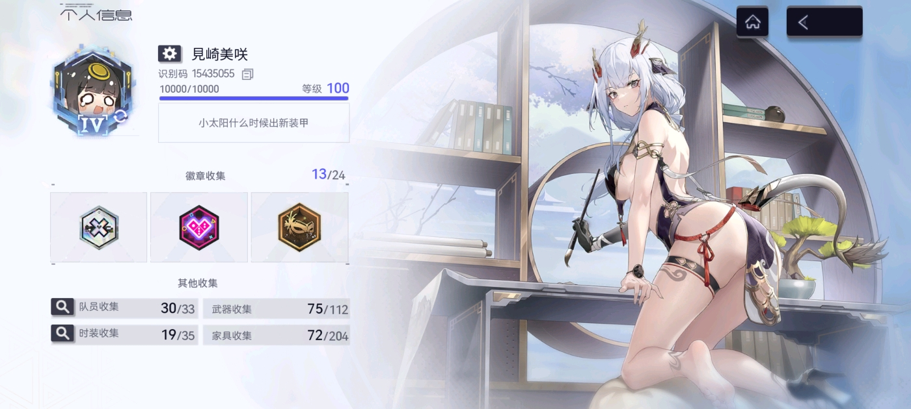

## 观前提示
本人是开服玩过没多久弃坑，并在1.5版本被凯西娅吸引重新建号回坑、到现在玩了10个月尘白的玩家。个人属于纯xp玩家，氪了1k多进去都是买皮肤，从一开始的兴趣满满到现在也懒得上线，上个泳装版本就几乎没玩。写这篇纯属有感而发，都是个人作为玩家的主观观点，至于行业内部利益相关的复杂因素就不予讨论了。可能写的比较乱望见谅。

  
## 开服
尘白这个游戏真的是前无古人后无来者了。他诞生之初玩法无聊、建模一般，作为一个tps游戏手感又是依托（显然这些问题到现在也没有显著的改善），美少女没什么涩点，被预测活不过一年。开服一波热度过去后，尘白便没什么人关注了，此时游戏内容却偷偷转型，逐渐开始其媚宅攻势。  
  
## 借麻辣而起的热度
尘白的第一个大转折点和引流潮在1.5版本，这也是吸引我回坑的时间节点。当时热议的二游官方普遍高高在上，对玩家的意见置之不理，节奏大了就是冷处理（尤其是强度方面）。凯西娅上线后强度令玩家大跌眼镜，于是尘白b站官号在1月20号深夜一场亲民化的讨论直播让传统二游玩家们了解到，原来有这样一款二游，官方可以平心静气放下面子和他们交流并改进，福利不错，而且角色媚宅完全符合他们的需求，不少难民开始入坑尘白禁区。  
  
官方发现了流量的秘诀，于是此后的尘白在媚宅、麻辣、服务性上逐渐升温。情人节数封角色对玩家的告白邮件、往后几个版本极其麻辣的pv……社区爆了，更多的人涌入这款游戏。周年版本，尘白靠着麻辣火锅联动和一系列角色告白视频彻底打响了麻辣的旗号。  
## 矛盾的产生 
这款开服褒姒的手游成功因为抓住了大环境的趋势而起死回生，逐渐站上热度的高点，但代价是什么呢？尘白大紫大红的时候，网络上的男女矛盾也在不断激化，逐渐侵蚀着二游社区，有男不玩的口号越喊越响。吸引到的玩家多了，其中不乏大量较为极端的，他们拿自家游戏官方的做法拉踩其他游戏和他们的玩家，尘白逐渐站上了社区讨论的风口浪尖，众矢之的，尘白官方一旦犯一点点错，都会被放完全大化。  
  
这些极端玩家们要求着作为服务业的官方做到”绝对麻辣“，于是删除男后勤、换cv、与coser取消合作、最终到这次节奏的删除男npc……官方的做法也在舆论的影响下变得越来越极端。个人认为这些做法并不是必要的，完全是为了麻辣而麻辣、为了服务而服务。仅论游戏内容方面，男后勤男npc都可以补全游戏世界观，只要避免雷区、游戏重心还是在女角色上即可。开始官方是有路可选的，但是他们渴望热度，完全听取了玩家们的意见，现在他们无路可选了，一旦犯错只能投入大量成本去安抚玩家，做法不这么极端就会被口诛笔伐。  
  
## 总结
回到2.3文案的暴雷，诚然官方确实做错了，但罪不至此，让事件扩大化的导火索在很久之前就被埋下了。此次事件只会让尘白陷入更加严重的文字狱，着实讽刺。  
  
或许官方打出服务业旗号的那一刻便意味着这个游戏依然走上不归路，他们似在造神，但谁都知道，人的需求是无法被完全满足的。一个好的手游应当听取玩家的意见，但不应为了玩家的情绪价值就处处皆听，完全不想自己如何处理才是恰当的。如今的尘白俨然是在走钢丝，社区对他们越来越严苛，留给官方的缓冲余地越来越小。一般手游的寿终正寝尘白估计已无福消受，不知未来何时的暴雷会让他摔得很惨，或是当场死亡，或是逐渐消失热度，最终死了也无人关心，变成一桩笑料罢了。